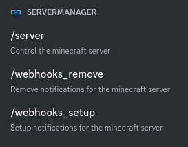
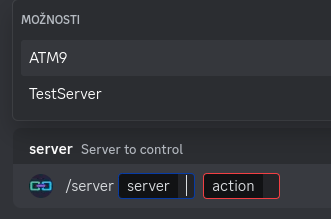
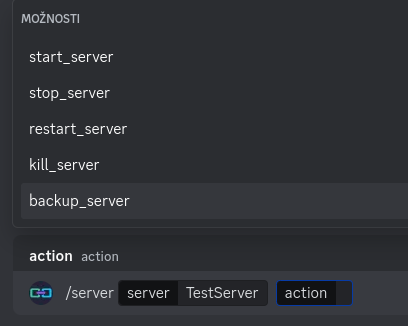

# Project Goal

A Minecraft server manager that can be controlled by my friends on a Discord server. This Discord bot uses [CraftyControl](https://www.craftycontrol.com/) to manage Minecraft servers.

## Features

- [x] Start/stop/backup server
- [x] Ability to add webhooks to the server
- [x] Multiple server management
- [x] Windows auto-sleep management (disables auto-sleep in Windows)
- [x] Display currently playing players as Discord bot status
- [ ] Turn off the server when no one is online for x minutes
   - [ ] Configurable using the Discord bot
- [ ] Send commands to the Minecraft server using the bot
- [ ] Minecraft server backup command

## Start your PC Discord bot

I recommend using this [Discord bot](https://github.com/Floxicek/remote-computer-start-discord-bot) hosted on a Raspberry Pi (or NAS) to start your computer.

## Setup

To set up the project, follow these steps:

### Discord Bot

1. **Create a new Discord application**:

   - Go to the [Discord Developer Portal](https://discord.com/developers/applications).
   - Click on **New Application**.
   - Give your application a name and click **Create**.

2. **Create a bot user**:

   - In your application, go to the **Bot** tab.
   - Click **Add Bot** and confirm by clicking **Yes, do it!**.
   - Under **Token**, click **Copy** to copy your bot token. You will need this later.

3. **Invite your bot to your server**:
   - Go to the **OAuth2** tab.
   - Under **OAuth2 URL Generator**, select the `bot` scope.
   - Under **Bot Permissions**, select the permissions your bot needs.
   - Copy the generated URL and open it in your browser.
   - Select the server you want to add the bot to and click **Authorize**.

### Crafty Controller

1. **Install Crafty Controller**:

   - Follow the installation instructions on the [CraftyControl website](https://wiki.craftycontrol.com/en/3/Install%20Guides).

2. **Create Minecraft servers**:
   - Open Crafty Controller.
   - Navigate to the **Servers** tab.
   - Click **Add Server** and follow the prompts to create your Minecraft servers.

### Minecraft Server Manager Bot

> **Note**: This script is made for **Python 3.13.0**. If you are using an older version, you will need to modify `requirements.txt`.

1. **Clone the repository**:

   ```sh
   git clone https://github.com/Floxicek/minecraft-server-manager-bot
   cd minecraft-server-manager-bot
   ```

2. **Create a virtual environment**:

   ```sh
   python -m venv .venv
   ```

3. **Activate the virtual environment**:

   - On Windows:
     ```sh
     .\.venv\Scripts\activate
     ```
   - On macOS and Linux:
     ```sh
     source .venv/bin/activate
     ```

4. **Install the required dependencies**:

   ```sh
   pip install -r requirements.txt
   ```

5. **Set up environment variables**:
   Create a `.env` file in the root directory and add the following:

   ```env
   DISCORD_TOKEN=your_discord_token
   CRAFTY_TOKEN=your_crafty_token
   WEBHOOK_URL=your_webhook_url
   SETUP_PASSWORD=your_setup_password
   ```

6. **Change guild id**
   find id of your discord server and put it the `main.py`
   `MY_GUILD = discord.Object(id=615248760766988311)`

7. **Run the application**:
   ```sh
   python main.py
   ```

## Images

### Commands


### Select Server from the Menu
Automatically fetched from CraftyControl


### Showing Options for Server Actions


## Fix Certificate Error

## Temporary solution

To ignore unverified HTTPS requests, set the following environment variable:

```sh
set PYTHONWARNINGS=ignore:Unverified HTTPS request
```

### Permanent Solution (Windows)

1. Open System Properties:
   - Press `Win + R`, type `sysdm.cpl`, and press Enter.
2. Navigate to the **Advanced** tab and click **Environment Variables**.
3. Under **System Variables** or **User Variables**, click **New**.
4. Add the following:
   - **Variable Name**: `PYTHONWARNINGS`
   - **Variable Value**: `ignore:Unverified HTTPS request`
5. Click **OK** to save.
